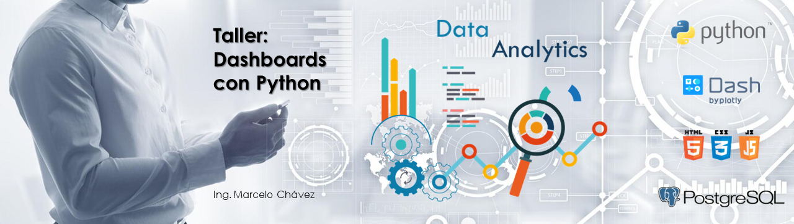

# TALLER DE DASHBOARDS CON PYTHON  
El presente repositorio muestra una introducción al desarrollo de Dashboards con **Python**
## Tecnología utilizada:  
**Lenguaje de Programación:** Python  
**Framework Web:** Dash Community  
### Developer: Ing. Marcelo Chávez  
Ingeniero Estadístico Informático, experto en Gestión de Datos, y con experiencia en el liderazgo de áreas técnicas o proyectos orientados a:

* Sistemas de Información
* Business Intelligence (Data Warehousing, Cubos de información, y Minería de Datos)
* Automatización de Procesos Estadísticos con Python, 

[Ing. Marcelo Chávez](https://www.linkedin.com/in/marcelochavezec/){:target="_blank"}
<a href="[http://example.com/](https://www.linkedin.com/in/marcelochavezec)" target="_blank">Ing. Marcelo Chávez</a>

**© 2023**
